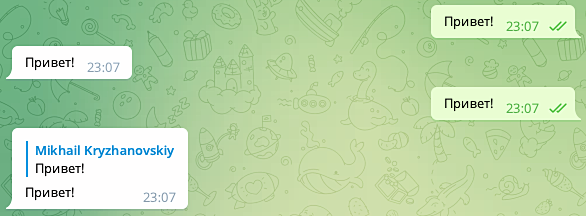

# 📣 Эхо-бот

---
### Определения

- **Update** ("апдейт") - сообщение от сервера Telegram, которое получает бот.

- **Handler** ("обработчик") - функция, которая обрабатывает апдейт. В идеале, одна функция на каждый тип апдейтов с одинаковым или близким содержимым.

- **Dispatcher** ("диспетчер") - специальный объект, который занимается получением апдейтов от серверов Telegram, распаковывает их и передает в соответствующие хэндлеры (обработчики).

- **Фильтр** - шаблон, которому должен соответствовать апдейт или его часть, чтобы сработал отвечающий за него хэндлер

---
# Подотовка

```python
# импорт бота, диспетчера, фильтров
from aiogram import Bot, Dispatcher, filters, F

API_TOKEN = 'BOT TOKEN HERE'

# Создаем объекты бота и диспетчера
bot = Bot(token=API_TOKEN)
dp = Dispatcher()

# ...

if __name__ == '__main__':
    dp.run_polling(bot)
```

---
# /start

```python
@dp.message(filters.Command("start"))
async def process_start_command(message: Message):
    await message.answer('Привет!\nМеня зовут Эхо-бот!\nНапиши мне что-нибудь')
```

---
# /help

```python
@dp.message(filters.Command('help'))
async def process_help_command(message: Message):
    await message.answer('Напиши мне что-нибудь и в ответ '
                         'я пришлю тебе твое сообщение')
```
---
# Текст

```python
@dp.message(F.text)
async def send_echo(message):
    await message.reply(text=message.text)
```

---
# Фото
```python
@dp.message(F.photo)
async def photo_msg(message):
    # Фото с индексом -1 берёт фото с наилучшим качеством
    await message.answer_photo(message.photo[-1].file_id)

```
---
# Стикер
```python
@dp.message(F.sticker)
async def sticker_msg(message):
    await message.answer_sticker(message.sticker.file_id)
```
---

# Регистрация хендлера (2 способ)
```python
async def process_help_command(message):
    await message.answer('Напиши мне что-нибудь и в ответ '
                         'я пришлю тебе твое сообщение')

dp.message.register(process_help_command, Command(commands=['help']))
```
---
# answer / reply

1 - message.answer()
2 - message.reply()

---
## Полноценный хендлер на все виды сообщений
```python
@dp.message()
async def send_echo(message: Message):
    try:
        await message.send_copy(chat_id=message.chat.id)
    except TypeError:
        await message.reply(text='Данный тип апдейтов не поддерживается '
                                 'методом send_copy')
```
