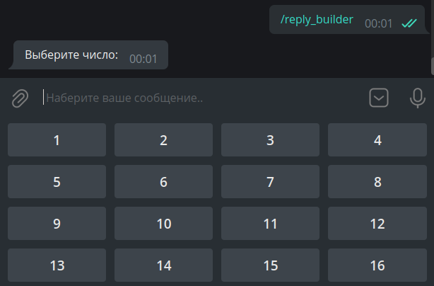

# 🕹️ Кнопки

---
# План
1. Обычне кнопки
2. Инлайн-кнопки
3. Алерты
4. Конструктор клавиатур
---

# Обычные кнопки


---
**Создание кнопок и размещение**

```python
btn1 = types.KeyboardButton(text='тест')
btn2 = types.KeyboardButton(text='р')
btn3 = types.KeyboardButton(text='л')
kb = [
    [btn1, btn2 ],  # первая строка
    [btn3]          # вторая строка
]
```

**Создание клавиатуры**

```python
# создание клавиатуры с кнопками
keyboard = types.ReplyKeyboardMarkup(
    keyboard=kb,
    resize_keyboard=True    # делает кнпки компактными
)
```

---
**Прикрпление к хендлеру**
Добавляем в `answer` параметр `reply_markup`
```python
@dp.message(filters.Command("keyboard"))
async def cmd_keyboard(message):
    await message.answer("Нажмите на кнопку", reply_markup=keyboard) 
```

---

# Инлайн-кнопки


---

**Создание кнопок и размещение**

```python
btn1 = types.InlineKeyboardBuilder(
    text='GitHub', 
    url="https://github.com"        # необязательных аргумент для ссылок
    )
btn2 = types.InlineKeyboardBuilder(
    text='text', 
    callback_data="random_value"    # для привязки кнопки 
                                    # к другому хендлеру (см. дальше)
    )
btn3 = types.InlineKeyboardBuilder(text='какой-то текст')
kb = [
    [btn1, btn2 ],  # первая строка
    [btn3]          # вторая строка
]
```
---

**Создание клавиатуры**

```python
# создание клавиатуры с кнопками
keyboard = types.ReplyKeyboardMarkup(
    keyboard=kb,
    resize_keyboard=True    # делает кнопки компактными
)
```

**Прикрпление к хендлеру**
```python
@dp.callback_query(F.data == "random_value")
async def send_random_value(callback: types.CallbackQuery):
    await callback.message.answer(str(randint(1, 10)))
```
---

**Алерт**


---
Доделаем предыдущий хендлер
```python
@dp.callback_query(F.data == "random_value")
async def send_random_value(callback: types.CallbackQuery):
    await callback.message.answer(str(randint(1, 10)))
    await callback.answer(
        text="Спасибо, что воспользовались ботом!",
        show_alert=True
    )
```
---

# Конструктор клавиатур
- Удобен, если нужно создать много однотипных кнопок



---

**Конструктор для обычных кнопок**
```python
from aiogram.utils.keyboard import ReplyKeyboardBuilder
# ...

builder = ReplyKeyboardBuilder()
for i in range(1, 17):
    builder.add(types.KeyboardButton(text=str(i)))
builder.adjust(4)       # количество кнопок в одном ряду
```
*Метод row*
Ручное создание кнопок на двух строчках
```python
builder.row(
    types.KeyboardButton(text='Кнопка1'),
    types.KeyboardButton(text='Кнопка2')
    )
builder.row(types.KeyboardButton(text='Кнопка2'))
```

---
**reply_markup**
Не забыть про метод `as_markup`, которого не было в обычных клавиатурах
```python
await message.answer(
        "Выберите число:",
        reply_markup=builder.as_markup(resize_keyboard=True),
    )
```
---
**Конструктор инлайн-кнопок**
```python
from aiogram.utils.keyboard import InlineKeyboardBuilder
# ...

builder = InlineKeyboardBuilder()
builder.row(types.InlineKeyboardButton(text="Инлайн-кнопка"))

```
**Отправка клавиатуры**
```python
await message.answer(
    "Нажмите на кнопку,
    reply_markup=builder.as_markup()
    )
```

